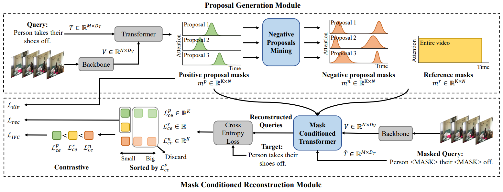

# Implementation practice for [CPL](https://openaccess.thecvf.com/content/CVPR2022/papers/Zheng_Weakly_Supervised_Temporal_Sentence_Grounding_With_Gaussian-Based_Contrastive_Proposal_Learning_CVPR_2022_paper.pdf) 

## Pipeline



## Requiments

- pytorch
- h5py
- nltk
- fairseq

## Quick Start

### Data Preparation

```
data
├── activitynet
│   ├── sub_activitynet_v1-3.c3d.hdf5
│   ├── glove.pkl
│   ├── train_data.json
│   ├── val_data.json
│   ├── test_data.json
├── charades
│   ├── i3d_features.hdf5
│   ├── glove.pkl
│   ├── train.json
│   ├── test.json
```

